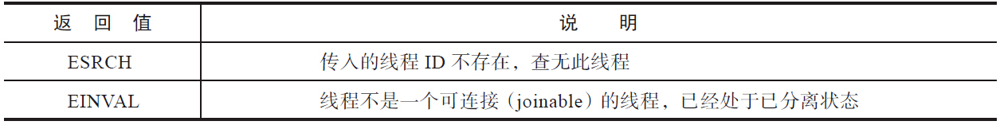

# 创建线程（pthread_create）

`pthread_create`用来创建线程。

## 函数声明


```cpp
#include <pthread.h>
int pthread_create(pthread_t *thread, 
                   const pthread_attr_t *attr, 
                   void *(*start_routine) (void *), 
                   void *arg);
```

## 参数

第一个参数是pthread_t类型的指针，如果线程创建成功的话，会将分配的线程ID填入该指针指向的地址。线程的后续操作将使用该值作为线程的唯一标识。

第二个参数是pthread_attr_t类型，通过该参数可以定制线程的属性，比如可以指定新建线程栈的大小、调度策略等。如果创建线程无特殊的要求，该值也可以是NULL，表示采用默认属性。

第三个参数是线程需要执行的函数。创建线程是为了让线程执行一定的任务。线程创建成功之后，该线程就会执行start_routine函数，该函数之于线程，就如同main函数之于主线程。

第四个参数是新建线程执行的start_routine函数的参数，它必须通过把引用作为指针强制转换为 void 类型进行传递。如果没有传递参数，则使用 NULL。

## 返回值

若成功则返回0，否则返回错误码。


| 返回值   | 描述                                                         |
| -------- | ------------------------------------------------------------ |
| `EAGAIN` | 系统资源不够，或者创建线程的个数超过系统对一个进程中线程总数的限制 |
| `EINVAL` | 第二个参数attr的值不合法                                     |
| `EPERM`  | 没有合适的权限来设置调度策略或参数                           |


# 获取线程自身ID（pthread_self）

因为线程是轻量级进程，是操作系统调度器的最小单位，所以需要一个数值来唯一标识该线程。pthread_create函数产生并记录在第一个参数指向地址的线程ID中，属于NPTL线程库的范畴，线程库的后续操作，就是根据该线程ID来操作线程的。

线程库NPTL提供了pthread_self函数，可以获取到线程自身的ID：

```cpp
#include <pthread.h>
pthread_t pthread_self(void);
```

在同一个线程组内，线程库提供了接口，可以判断两个线程ID是否对应着同一个线程：

```cpp
#include <pthread.h>
pthread_t pthread_equal(pthread_t t1, pthread_t t2);
```

返回值为0表示两个线程是同一个线程，非0则表示不是同一个线程。

# 线程的连接（pthread_join）

`pthread_join`用来等待某线程的退出并接收它的返回值。`pthread_join`是一个线程阻塞的函数，调用它的函数将一直等待到被等待的线程结束为止，当函数返回时，被等待线程的资源被收回。

## 函数声明

```cpp
#include <pthread.h>
int pthread_join(pthread_t thread, void **status);
```

## 参数

第一个参数为被等待的线程ID。

第二个参数为一个用户定义的指针，它可以用来存储被等待线程的返回值。

## 返回值

若成功则返回0，否则返回错误码。

## 示例一：有pthread_join的效果

```cpp
#include <cstdio>
#include <unistd.h>
#include <pthread.h>

static int s_count = 0;

void* thread_count(void* param)
{
    for (int i = 0; i < 5; i++)
    {
        s_count++;
        printf("thread_count is = %d\n", s_count);
        sleep(1);
    }
    return nullptr;
}

int main()
{
    pthread_t thread_id;
    pthread_create(&thread_id, nullptr, thread_count, nullptr);
    pthread_join(thread_id, nullptr);
    printf("The count is = %d\n", s_count);
    getchar();
    return 0;
}
```

程序输出为：

```
thread_count is = 1
thread_count is = 2
thread_count is = 3
thread_count is = 4
thread_count is = 5
The count is = 5
```

主线程等待子线程执行完毕。

## 示例二：没有pthread_join的效果

```cpp
#include <cstdio>
#include <unistd.h>
#include <pthread.h>

static int s_count = 0;

void* thread_count(void* param)
{
    for (int i = 0; i < 5; i++)
    {
        s_count++;
        printf("thread_count is = %d\n", s_count);
        sleep(1);
    }
    return nullptr;
}

int main()
{
    pthread_t thread_id;
    pthread_create(&thread_id, nullptr, thread_count, nullptr);
    //pthread_join(thread_id, nullptr);
    printf("The count is = %d\n", s_count);
    getchar();
    return 0;
}
```

程序输出为：

```
The count is = 0
thread_count is = 1
thread_count is = 2
thread_count is = 3
thread_count is = 4
thread_count is = 5
```

## 示例三：向线程传递参数

```cpp
#include <cstdio>
#include <pthread.h>
#include <cstdlib>

#define NUM_THREADS     5

struct thread_data {
    int  thread_id;
    char* message;
};

void* say_hello(void* threadarg)
{
    thread_data* my_data = (thread_data*) threadarg;
    printf("say_hello(): %d %s\n", my_data->thread_id, my_data->message);
    pthread_exit(nullptr);
}

int main()
{
    pthread_t threads[NUM_THREADS];
    thread_data td[NUM_THREADS];

    for (int i = 0; i < NUM_THREADS; i++) {
        printf("main(): creating thread %d \n", i);
        td[i].thread_id = i;
        td[i].message = (char*)"hello";
        int rc = pthread_create(&threads[i], nullptr, say_hello, (void*)& td[i]);
        if (rc) 
        {
            printf("error: unable to create thread, error code: %d\n", rc);
            exit(-1);
        }
    }
    getchar();
    pthread_exit(nullptr);
}
```

程序输出结果：

```
main(): creating thread 0 
main(): creating thread 1 
say_hello(): 0 hello
main(): creating thread 2 
say_hello(): 1 hello
main(): creating thread 3 
say_hello(): 2 hello
main(): creating thread 4 
say_hello(): 3 hello
say_hello(): 4 hello
```

## 示例四：不加锁的后果

```cpp
#include <cstdio>
#include <pthread.h>
#include <cstdlib>

const int NUM_THREADS = 100;
static int s_count = 0;

void* add(void* args)
{
    for (int i=0; i<100; i++)
    {
        s_count++;
    }
}

int main()
{
    pthread_t threads[NUM_THREADS];
    for (int i=0; i< NUM_THREADS; i++)
    {
        int nc = pthread_create(&threads[i], nullptr, add, nullptr);
        if (nc)
        {
            printf("error: unable to create thread, error code: %d\n", nc);
            exit(-1);
        }
    }
    printf("s_count=%d\n", s_count);
    getchar();
    pthread_exit(nullptr);
}
```

程序输出结果：

```
s_count=9800
```

# 线程的默认属性pthread_attr_t

线程创建的第二个参数是pthread_attr_t类型的指针，pthread_attr_init函数会将线程的属性重置成默认值。

```cpp
pthread_attr_t attr;
pthread_attr_init(&attr);
```


# 退出线程（pthread_exit）

下面的三种情况中，线程会终止，但是进程不会终止（如果线程不是进程组里的最后一个线程的话）：

- 创建线程时的start_routine函数执行了return，并且返回指定值。
- 线程调用pthread_exit。
- 其他线程调用了pthread_cancel函数取消了该线程。

下面的两种情况中，整个线程组内的所有线程都会终止：

- 如果线程组中的任何一个线程调用了exit函数。
- 主线程在main函数中执行了return语句。

pthread_exit和线程启动函数（start_routine）执行return是有区别的：

在start_routine中调用的任何层级的函数执行pthread_exit()都会引发线程退出，而return只能是在start_routine函数内执行才能导致线程退出。

# 线程的分离（pthread_detach）

默认情况下，新创建的线程处于可连接（Joinable）的状态，可连接状态的线程退出后，需要对其执行连接操作，否则线程资源无法释放，从而造成资源泄漏。

如果其他线程并不关心线程的返回值，那么连接操作就会变成一种负担：你不需要它，但是你不去执行连接操作又会造成资源泄漏。这时候你需要的东西只是：线程退出时，系统自动将线程相关的资源释放掉，无须等待连接。NPTL提供了pthread_detach函数来将线程设置成已分离（detached）的状态，如果线程处于已分离的状态，那么线程退出时，系统将负责回收线程的资源，如下：

```cpp
#include <pthread.h>
int pthread_detach(pthread_t thread);
```

线程的状态之中，可连接状态和已分离状态是冲突的，一个线程不能既是可连接的，又是已分离的。因此，如果线程处于已分离的状态，其他线程尝试连接线程时，会返回EINVAL错误。

`pthread_detach`的错误码如下：



所谓已分离，并不是指线程失去控制，不归线程组管理，而是指线程退出后，系统会自动释放线程资源。若线程组内的任意线程执行了exit函数，即使是已分离的线程，也仍然会受到影响，一并退出。

将线程设置成已分离状态，并非只有pthread_detach一种方法。另一种方法是在创建线程时，将线程的属性设定为已分离：

```cpp
#include <pthread.h>
int pthread_attr_setdetachstate(pthread_attr_t *attr, int detachstate);
int pthread_attr_getdetachstate(pthread_attr_t *attr, int *detachstate);
```

`detachstate`的可能值如下：


# 互斥量


什么是临界区？临界区指的是一段代码


互斥量是mutal exclusive的缩写，即mutex。

# 初始化mutex

posix提供了两种定义和初始化互斥量的方式。

一种是将`PTHREAD_MUTEX_INITIALIZER`赋值给定义的互斥量：

```cpp
#include <pthread.h>
pthread_mutex_t mutex = PTHREAD_MUTEX_INITIALIZER;
```

一种是使用`pthread_mutex_init()`对互斥量进行动态的初始化。

```cpp
#include <pthread.h>
int pthread_mutex_init(pthread_mutex_t *mutex,
                      const pthread_mutexattr_t *attr);
```

第二个pthread_mutexattr_t指针的入参，是用来设定互斥量的属性的。大部分情况下，并不需要设置互斥量的属性，传递NULL即可，表示使用互斥量的默认属性。

调用pthread_mutex_init()之后，互斥量处于没有加锁的状态。

# 销毁mutex

在确定不再需要互斥量的时候，就要销毁它。在销毁之前，有三点需要注意：

- 使用PTHREAD_MUTEX_INITIALIZER初始化的互斥量无须销毁。
- 不要销毁一个已加锁的互斥量，或者是真正配合条件变量使用的互斥量。
- 已经销毁的互斥量，要确保后面不会有线程再尝试加锁。

销毁互斥量的接口如下：

```cpp
int pthread_mutex_destory(pthread_mutex_t *mutex);
```

当互斥量处于已加锁的状态，或者正在和条件变量配合使用，调用pthread_mutex_destroy函数会返回EBUSY错误码。

# 加锁和解锁mutex

POSIX提供了如下接口：


在调用pthread_lock()的时候，可能会遭遇以下几种情况：

- 互斥量处于未锁定的状态，该函数会将互斥量锁定，同时返回成功。
- 发起函数调用时，其他线程已锁定互斥量，或者存在其他线程同时申请互斥量，但没有竞争到互斥量，那么pthread_lock()调用会陷入阻塞，等待互斥量解锁。

在等待的过程中，如果互斥量持有线程解锁互斥量，可能会发生如下事件：

- 函数调用线程是唯一等待者，获得互斥量，成功返回。

- 函数调用线程不是唯一等待者，但成功获得互斥量，返回。

- 函数调用线程不是唯一等待者，没能获得互斥量，继续阻塞，等待下一轮。

如果在调用pthread_lock()线程时，之前已经调用过pthread_lock()且已经持有了互斥量，则根据互斥锁的类型，存在以下三种可能。

- PTHREAD_MUTEX_NORMAL：这是默认类型的互斥锁，这种情况下会发生死锁，调用线程永久阻塞，线程组的其他线程也无法申请到该互斥量。
- PTHREAD_MUTEX_ERRORCHECK：第二次调用pthread_mutex_lock函数时返回EDEADLK。
- PTHREAD_MUTEX_RECURSIVE：这种类型的互斥锁内部维护有引用计数，允许锁的持有者再次调用加锁操作。

